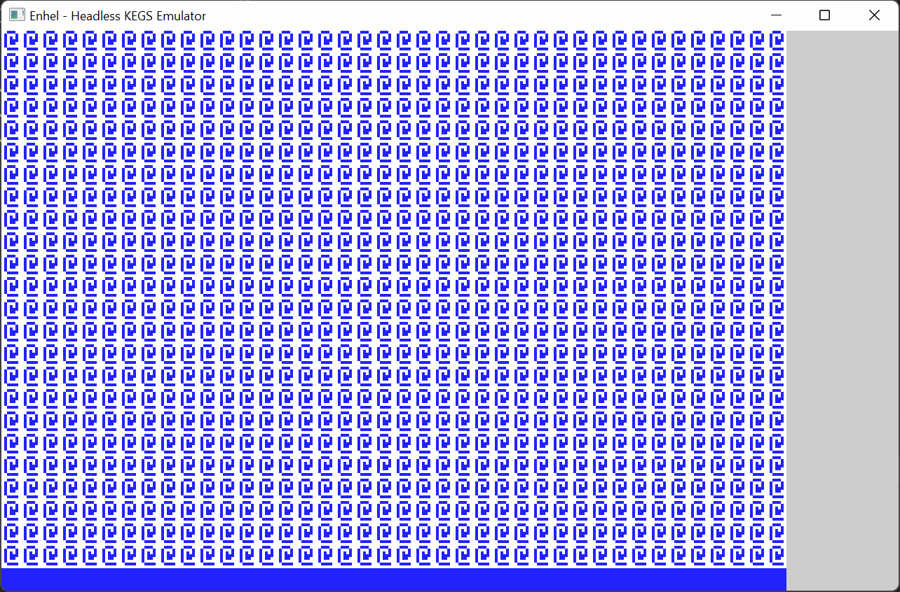

## Enhel Headless. Raylib Example (C++)

Example of emulator embedding using static linking. 
Tested on Windows (MSVC and MinGW compilers) and Ubuntu Linux (GCC compiler).

### Features

All emulator features are available: 
- Screen output
- Keyboard input
- Mouse input
- Sound output

### How to run

Add config.kegs and dependent files to the same directory as the compilation result. The emulator will start immediately